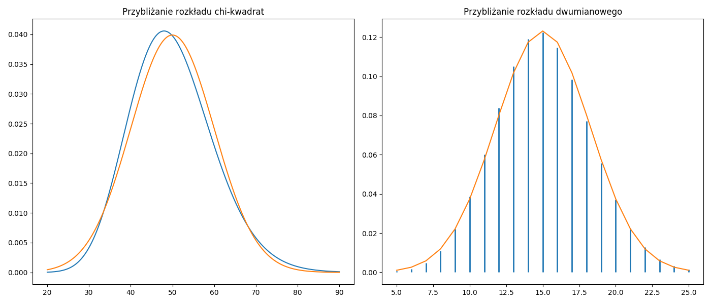
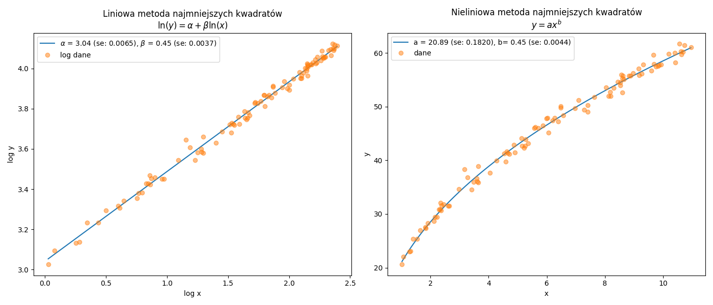
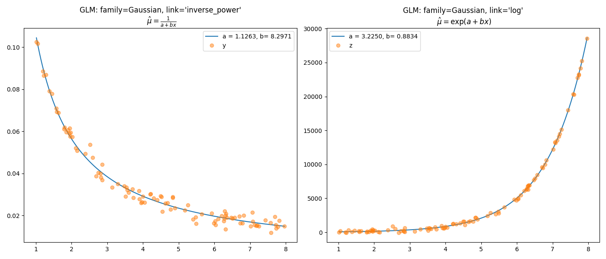

# Rozkład normalny {#R2}

---

## Funkcja gęstości {#R21}

Do funkcji [`scipy.stats.gennorm.pdf`](https://docs.scipy.org/doc/scipy/reference/generated/scipy.stats.gennorm.html) został zaimplementowany uogólniony rozkład normalny $GN(x\;|\;\beta,m,s)$ który można przedstawić za pomocą wzoru:
\begin{equation}
f(x\;|\;\beta,m,s)=\frac{\beta}{2\,s\,\Gamma(1/\beta)}\exp\left(-\left|\frac{x-m}{s}\right|^\beta\right)
(\#eq:n01)
\end{equation}
gdzie $\beta$ to parametr kształtu (shape), $s>0$ to parametr skali (scale) oraz $m$ to parametr przesunięcia. Przypadek dla $\beta=2$ został zaimplementowany do funkcji [`scipy.stats.norm.pdf`](https://docs.scipy.org/doc/scipy/reference/generated/scipy.stats.norm.html#scipy.stats.norm) czyli klasycznej wersji rozkładu normalnego $N(x\;|\;m,s)$ i jest dana wzorem:
\begin{equation}
f(x\;|\;m,s)=\frac{1}{s\sqrt{2\pi}}\exp{\left(-\frac{(x-m)^2}{2s^2}\right)}
(\#eq:n02)
\end{equation}

Do oszacowania parametrów rozkładu normalnego można wykorzystać funkcje [`scipy.stats.norm.fit`](https://docs.scipy.org/doc/scipy/reference/generated/scipy.stats.norm.html#scipy.stats.norm) która wykorzystuje metodę największej wiarygodności. Inaczej mówiąc, oszacowanie parametrów w rozkładzie normalnym sprowadza się do wyznaczenia estymatora średniej oraz obciążonego estymatora odchylenia standardowego na podstawie wzorów:
$$\hat{m}=\;E(X)=\;\sum_{i=1}^{n}x_i/n,
\quad\mbox{oraz}\quad \hat{s}_{\textrm{ML}}=\;\sqrt{V(X)}\quad=\sqrt{\sum_{i=1}^{n}(x_i-\hat{\mu})^2/n}
$$
Dodajmy, że dla małych próbek zalecane jest stosowanie nieobciążonego estymatora odchylenia standardowego $\hat{s}=\sqrt{\sum_{i=1}^{n}(x_i-\hat{m})^2/(n-1)}$
ale wraz ze wzrostem liczebności próby różnice między estymatorem obciążonym $\hat{s}_\textrm{ML}$ a nieobciążonym $\hat{s}$ zanikają. Warto zaznaczyć, że estymator parametru skali w uogólnionym rozkładzie normalnym dla $\beta=2$ będzie równy $\hat{s}\sqrt{2}$.

Gdy założymy, że parametr średniej (przesunięcie funkcji) $m=0$ i parametr odchylenia standardowego (skalowanie funkcji) $s=1$ to ogólny wzór funkcji $f(x\;|\;m,s)$ uprości się do postaci standardowej:
\begin{equation}
f(x)=\frac{1}{\sqrt{2\pi}}\exp{\left(-\frac{x^2}{2}\right)}
(\#eq:n03)
\end{equation}
Warto zauważyć, że dokonując prostych przekształceń standardowej funkcji prawdopodobieństwa $f(x)$ np. rozkładu normalnego otrzymamy wyniki które będą tożsame z uzyskanymi na podstawie funkcji $g(x\;|\;m,s)$.
  
\begin{align}
g(x\,|\,m, s)=\;f\big((x-m)/s\big)/s \quad\longrightarrow\quad
&
\textrm{funkcja gęstości} (\#eq:G01)\\[2.5pt]
\int_{-\infty}^{a}g(x\,|\,m,s)\;dx=\;\int_{-\infty}^{a}f\big((x-m)/s\big)\;dx \quad\longrightarrow\quad
&
\textrm{dystrybuanta} (\#eq:I01)\\[2.5pt]
q_{\alpha\,|\,m,s}=\;z_{\alpha\,|\,0,1}\cdot s+m \quad\longrightarrow\quad
&
\textrm{kwantyle} (\#eq:Q01)\\[2.5pt]
rv_{i\,|\,m,s}=\;rv_{i\,|\,0,1}\cdot s+m \quad\longrightarrow\quad
&
\textrm{liczby losowe} (\#eq:RV01)
\end{align}

Dla dużych prób rozkłady ciągłe oraz dykretne można przybliżać rozkładem normalnym.
W przypadku rozkładu chi-kwadrat będziemy mieli $N(df,\sqrt{2\;df})$ gdzie $df=n-1$ to stopnie swobody. Natomiast dla rozkładu dwumianowego $N(np,\sqrt{np(1-p)})$.
```{r engine='python',engine.path='python3',python.reticulate=FALSE}
import numpy as np
import scipy.stats as stats
import matplotlib.pyplot as plt
  
xc = np.arange(20,90,0.01); xd = np.arange(5,25+1,1)

fig = plt.figure(figsize=(14,6))
ax1 = fig.add_subplot(1,2,1)
ax2 = fig.add_subplot(1,2,2)

ax1.plot(xc,stats.chi2.pdf(xc,df=50))
ax1.plot(xc,stats.norm.pdf(xc,loc=50,scale=(2*50)**0.5))
ax2.vlines(xd, [0], stats.binom.pmf(xd, n= 50, p= 0.3),lw=2,color='C0')
ax2.plot(xd,stats.norm.pdf(xd,loc=50*0.3,scale=(50*0.3*0.7)**0.5),color='C1')
ax1.set_title("Przybliżanie rozkładu chi-kwadrat")
ax2.set_title("Przybliżanie rozkładu dwumianowego")
fig.tight_layout()
plt.savefig('plt01.png')
```
```{r plt01, echo=FALSE, fig.pos= 'h', fig.show='hold', fig.align='center', fig.cap="Przybliżanie rozkładów.", out.width = '100%'}

```

## Liniowy model regresji {#R22}

Współczynniki modelu liniowego $Y=\hat{\beta} X+\epsilon$ można znaleźć w stosunkowo prosty sposób wykonując działania na macierzach:
\begin{equation}
\hat{\beta}=(X^{T}X)^{-1}X^{T}Y
(\#eq:n04)
\end{equation}
gdzie $Y$ to wektor zmiennej zależnej pochodzącej z rozkładu normalnego natomiast $X$ to macierz zmiennych niezależnych. 

Błędy standardowe oszacowanych parametrów to pierwiastki kwadratowe elementów na głównej przekątnej macierzy wariancji i kowariancji:
\begin{equation}
D^2(\hat{\beta})=(X^TX)^{-1}S^2_{e}
(\#eq:n05)
\end{equation}
gdzie $S^2_e=e^Te/(n-k-1)$ to wariancja reszt i $e=Y-\hat{\beta}X$ to wektor reszt.

Stopień wyjaśnienia przez model zmiennej zależnej można ocenić za pomocą współczynnika determinacji:
\begin{equation}
R^2=\frac{\sum_{i=1}^{n}(\hat{y}-\bar{y})^2}{\sum_{i=1}^{n}(y-\bar{y})^2}
(\#eq:det)
\end{equation}

Siłę związku dwóch zmiennych można ocenić na podstawie współczynnika korelacji liniowej Pearsona który może być równy pierwiastkowi kwadratowemu współczynnika determinacji ponieważ $|r|=R$.
\begin{equation}
r=\mathrm{cov}(X,Y)/S_XS_Y
(\#eq:cor)
\end{equation}
gdzie: $\mathrm{cov}(X,Y)$ to kowariancja dwóch zmiennych natomiast $S_X$ i $S_Y$ to odchylenia standardowe zmiennych.

Błąd standardowy korelacji Pearsona dla dużej próby wyznaczamy według wzoru:
\begin{equation}
SE_{r}=\sqrt{(1-r^2)/n}
(\#eq:SEcor)
\end{equation}

Wszystkie wyniki można uzyskać za pomocą funkcji [`scipy.stats.linregress`](https://docs.scipy.org/doc/scipy/reference/generated/scipy.stats.linregress.html#scipy.stats.linregress) ale tylko dla jednej zmiennej objaśniającej.
```{r engine='python',engine.path='python3',python.reticulate=FALSE}
from scipy import stats
import numpy as np

x = np.sort(stats.norm.rvs(size=300,loc=3,random_state=2305))
y = np.sort(stats.norm.rvs(size=300,scale=3,random_state=4101))

beta, const, r_value, p_value, SE_beta = stats.linregress(x, y)
SE_r = ((1-r_value**2)/(len(x)))**0.5
print("beta: %f, SE_beta: %f" % (beta,SE_beta))
print("cor: %f, SE_cor: %f" % (r_value,SE_r))
```
Przedstawiona powyżej procedura szacowania parametrów to metoda najmniejszych kwadratów która minimalizuje sumę kwadratów reszt:
\begin{equation}
RSS=e^Te\quad\longrightarrow\quad\mbox{min}
(\#eq:n06)
\end{equation}
Innym kryterium optymalizacji możne być maksymalizacja logarytmu wiarygodności:
\begin{equation}
LL=-\frac{n}{2}\ln(2\pi\sigma^2)-\frac{e^Te}{2\sigma^2}\quad\longrightarrow\quad\mbox{max}
(\#eq:n07)
\end{equation}
Obie procedury: metoda najmniejszych kwadratów \@ref(eq:n06) i metoda największej wiarygodności \@ref(eq:n07) dla dowolnej liczby zmiennych objaśniających zostały udostępnione w pakiecie [`statsmodels`](https://www.statsmodels.org/stable/examples/index.html#regression).
Ciekawą alternatywą jest wykorzystanie algorytmów optymalizacyjnych ogólnego przeznaczenia z pakietu [`scipy.optimize.minimize`](https://docs.scipy.org/doc/scipy/reference/generated/scipy.optimize.minimize.html#scipy.optimize.minimize). Takie rozwiązanie (patrz podrozdział \@ref(R33)) umożliwia szacowanie parametrów modeli o dowolnej postaci analitycznej po uprzednim zdefiniowaniu funkcji logarytmu wiarygodności.
```{r engine='python',engine.path='python3',python.reticulate=FALSE}
from scipy import stats
import numpy as np
import pandas as pd

df = pd.DataFrame(data={'x':np.sort(stats.norm.rvs(size=300,loc=3,random_state=2305)),
                        'y':np.sort(stats.norm.rvs(size=300,scale=3,random_state=4101))})

import statsmodels.formula.api as smf

m = smf.ols("y~x", data=df).fit()
print(m.summary())
```

## Nieliniowy model regresji {#R23}

Jeśli badana zależność ma charakter nieliniowy a zmienna objaśniana pochodzi z rozkładu normalnego to można zastosować nieliniową metodę najmniejszych kwadratów np. algorytm Levenberga-Marquardta lub Trust Region Reflective jeśli chcemy dodać ograniczenia przedziałowe na parametry. Obie procedury zostały zaimplementowane do funkcji
[`scipy.optimize.curve_fit`](https://docs.scipy.org/doc/scipy/reference/generated/scipy.optimize.curve_fit.html). Dodajmy jeszcze, że są to procedury iteracyjne które wymagają określenia parametrów startowych. W pewnych sytuacjach można je wyznaczyć za pomocą tzw. linearyzacji czyli po sprowadzeniu modelu nieliniowego do postaci liniowej ale nie zawsze jest to możliwe. Poniżej przykłady linearyzacji wybranych modeli nieliniowych:

* model potęgowy:

\begin{equation}
y=a\cdot x^b \quad \longrightarrow \quad \ln(y)=\alpha+\beta\cdot \ln(x)\quad \longrightarrow \quad \exp(\alpha)= a,\quad \beta=b
(\#eq:n08)
\end{equation}

* model Tornquista 1:

\begin{equation}
y=\frac{ax}{x+b} \quad \longrightarrow \quad \frac{1}{y}=\alpha+\beta\cdot \frac{1}{x}\quad \longrightarrow \quad \frac{1}{\alpha}= a,\quad \frac{\beta}{\alpha}=b
(\#eq:n09)
\end{equation}

```{r engine='python',engine.path='python3',python.reticulate=FALSE}
import scipy.stats as stats
import matplotlib.pyplot as plt
import statsmodels.formula.api as smf
import numpy as np
import pandas as pd
from scipy.optimize import curve_fit

x = stats.uniform.rvs(1,10,size=100, random_state=2305)
mu = 20.8 * x**0.45
y = stats.norm.rvs(loc=mu,scale=1,size=100,random_state=2305)
lx = np.log(x)
ly = np.log(y)
df = pd.DataFrame({'x':x,'y':y,'lx':lx,'ly':ly})

modLog = smf.glm('ly~lx', data=df).fit()
p = modLog.params.values
pse = np.diag(modLog.cov_params())**0.5

def modNLS(x,a,b):
    return a*x**b

sol, pcov = curve_fit(modNLS, x, y, p0=(np.exp(p[0]),p[1]))
se = np.diag(pcov)**0.5

fig = plt.figure(figsize=(14,6))
ax1 = fig.add_subplot(1,2,1)
ax2 = fig.add_subplot(1,2,2)
lX = np.linspace(np.min(lx),np.max(lx), 500)
ax1.plot(lX,p[0]+p[1]*lX,
         label='$\\alpha$ = %.2f (se: %.4f), $\\beta$ = %.2f (se: %.4f)' % (p[0],pse[0],p[1],pse[1]))
ax1.plot(lx,ly,'o',alpha=0.5,label='log dane')
ax1.set_xlabel("log x")
ax1.set_ylabel("log y")
ax1.legend()
ax1.set_title("Liniowa metoda najmniejszych kwadratów\n$\\ln(y)=\\alpha+\\beta\\ln(x)$")
X = np.linspace(np.min(x),np.max(x), 500)
ax2.plot(X,modNLS(X,sol[0],sol[1]),
         label='a = %.2f (se: %.4f), b= %.2f (se: %.4f)' % (sol[0],se[0],sol[1],se[1]))
ax2.plot(x,y,'o',alpha=0.5,label='dane')
ax2.set_title("Nieliniowa metoda najmniejszych kwadratów\n$y=ax^b$")
ax2.set_xlabel("x")
ax2.set_ylabel("y")
ax2.legend()
fig.tight_layout()
plt.savefig('modlin01.png')
```
```{r modlin01, echo=FALSE, fig.pos= 'h', fig.show='hold', fig.align='center', fig.cap="Graficzna prezentacja linearyzacji funkcji nieliniowej.", out.width = '100%'}

```
Alternatywnym rozwiązaniem jest metoda największej wiarygodności w której można założyć dowolny rozkład prawdopodobieństwa dla zmiennej zależnej. Ta metoda jest stosowana do estymacji parametrów uogólnionych modeli liniowych w których trzeba określić rozkład z rodziny rozkładów wykładniczych dla zmiennej objaśnianej. Dodatkowo dzięki funkcji wiążącej można rozpatrywać szególne przypadki powiązania zmiennej objaśniającej z predyktorem. Przykładowo dla rozkładu normalnego domyślnie jest estymowany model liniowy - opcja `identity`: $\hat{\mu}=\hat{y}$ ale możliwe są też takie przypadki jak `inverse_power`: $\hat{\mu}=1/\hat{y}$ oraz `log`: $\hat{\mu}=\exp(\hat{y})$ gdzie $\hat{y}=\beta_0+\sum_{j=1}^{n}\beta_j x_{ij}$. Warto zaznaczyć, że
średnia na skali logarytmicznej nie jest równa logarytmowi średniej na oryginalnej skali tzn.
$E(\ln Y_i)\neq \ln E(Y_i)$.

```{r engine='python',engine.path='python3',python.reticulate=FALSE}
import scipy.stats as stats
import matplotlib.pyplot as plt
import statsmodels.formula.api as smf
import statsmodels.api as sm
import numpy as np
import pandas as pd
from scipy.optimize import curve_fit

x = stats.uniform.rvs(1,7,size=100, random_state=2305)
mu = 1/(1.25+8.25*x)
MU = np.exp(3.25+0.88*x)
y = stats.norm.rvs(loc=mu,scale=0.0025,size=100,random_state=2305)
z = MU+stats.norm.rvs(scale=200,size=100,random_state=2305)
X = np.linspace(np.min(x),np.max(x), 500)
  
gaus1 = smf.glm('y~x', data=pd.DataFrame({'x':x,'y':y}),\
        family=sm.families.Gaussian(sm.families.links.inverse_power)).fit()
p = gaus1.params.values
pSE = np.diag(gaus1.cov_params())**0.5
gaus2 = smf.glm('z~x', data=pd.DataFrame({'x':x,'z':z}),\
        family=sm.families.Gaussian(sm.families.links.log)).fit()
P = gaus2.params.values
Pse = np.diag(gaus2.cov_params())**0.5
print("GLM: family=Gaussian, link='inverse_power'")
print(gaus1.summary().tables[1])
print("\nGLM: family=Gaussian, link='log'")
print(gaus2.summary().tables[1])

fig = plt.figure(figsize=(14,6))
ax1 = fig.add_subplot(1,2,1)
ax2 = fig.add_subplot(1,2,2)
ax1.plot(X, 1/(p[0]+p[1]*X),label='a = %.4f, b= %.4f' % (p[0],p[1]))
ax1.plot(x,y,'o',alpha=0.5,label="y")         
ax1.set_title("GLM: family=Gaussian, link='inverse_power'\n $\\hat{\\mu}=\\frac{1}{a+bx}$")
ax1.legend()
ax2.plot(X, np.exp(P[0]+P[1]*X),label='a = %.4f, b= %.4f' % (P[0],P[1]))
ax2.plot(x,z,'o',alpha=0.5,label='z')
ax2.set_title("GLM: family=Gaussian, link='log'\n $\\hat{\\mu}=\\exp(a+bx)$")
ax2.legend()
fig.tight_layout()
plt.savefig('modlin02.png')
```
```{r modlin02, echo=FALSE, fig.pos= 'h', fig.show='hold', fig.align='center', fig.cap="Graficzna prezentacja dwóch funkcji wiążących z wykorzystaniem rozkładu Gaussa.", out.width = '100%'}

```
