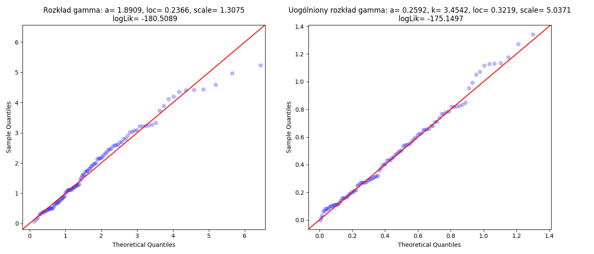
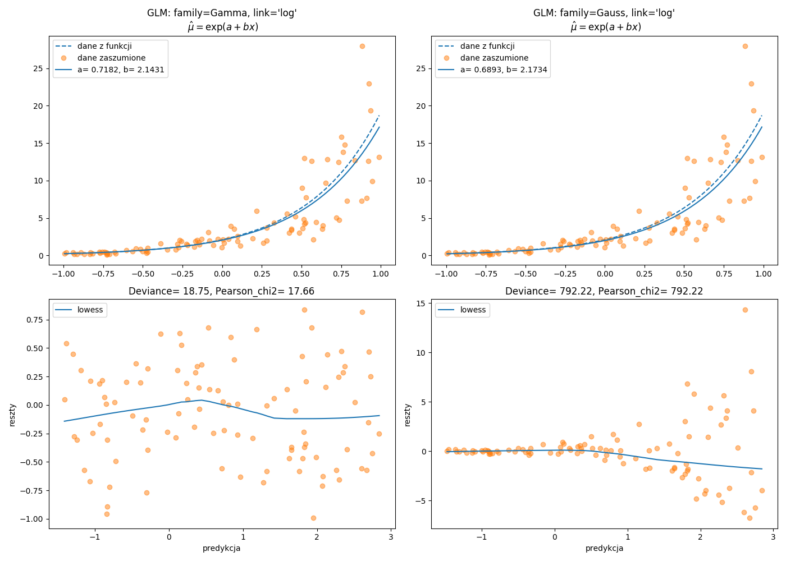
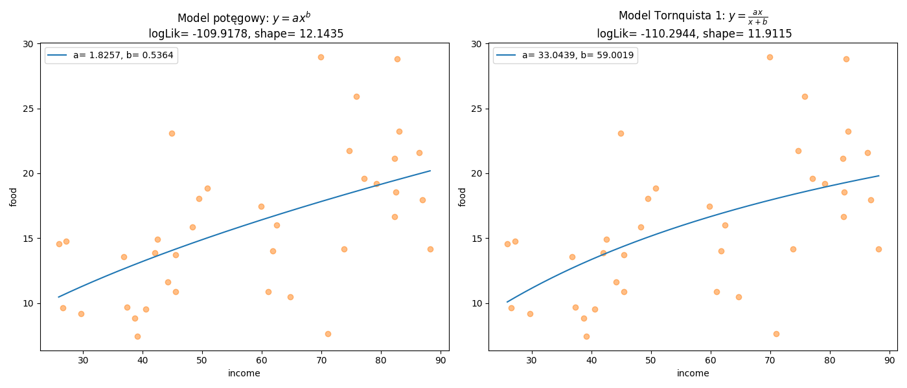

# Rozkład gamma {#R3}

---

## Funkcja gęstości {#R31}

Uogólniony rozkład gamma zaimplementowany do funkcji  [`scipy.stats.gengamma.pdf`](https://docs.scipy.org/doc/scipy/reference/generated/scipy.stats.gengamma.html#scipy.stats.gengamma) można przedstawić za pomocą wzoru:
\begin{equation}
f(x\;|\;a,k,m,s)=\frac{k(x-m)^{ka-1}}{s^{ka}\Gamma(a)}\exp\left(-\left(\frac{x-m}{s}\right)^k\right)
(\#eq:g01)
\end{equation}
gdzie $k\neq 0$ i $a>0$ to parametry kształtu (shape), $s>0$ to parametr skali (scale) oraz $m$ to parametr przesunięcia.
Przypadek dla $k=1$ został zaimplementowany do funkcji [`scipy.stats.gamma.pdf`](https://docs.scipy.org/doc/scipy/reference/generated/scipy.stats.gamma.html) jako trójparametrowa wersja rozkładu gamma która jest dana wzorem:
\begin{equation}
f(x\;|\;a,m,s)=\frac{(x-m)^{a-1}}{s^{a}\Gamma(a)}\exp\left(-\frac{x-m}{s}\right)
(\#eq:g02)
\end{equation}

Jeśli będziemy rozważać dwuparametrowy rozkład gamma tzn. z pominięciem parametru przesunięcia czyli $m=0$ to wtedy wzór rozkładu uprości się do postaci:
\begin{equation}
f(x\;|\;a,s)=\frac{x^{a-1}}{s^{a}\Gamma(a)}\exp\left(-\frac{x}{s}\right)\quad\mbox{gdzie}\quad E(X)=as,\; V(X)=as^2
(\#eq:g03)
\end{equation}
W innej implementacji tego rozkładu zamiast parametru skali $s$ (scale) jest stosowany parametr $r$ (rate) gdzie $r = 1 / s$:
\begin{equation}
f(x\;|\;a,r)=\frac{r^ax^{a-1}}{\Gamma(a)}\exp(-rx)\quad\mbox{gdzie}\quad E(X)=a/r,\; V(X)=a/r^2
(\#eq:g04)
\end{equation}

Do estymacji parametrów rozkładu można wykorzystać metodę największej wiarygodności która polega na optymalizacji zlogarytmowanej funkcji wiarygodności:
  \begin{align}
     LL_{scale} & =(a-1)\ln(y)-(y/s)-a\ln(s)-\ln\Gamma(a) (\#eq:g05)\\
     LL_{rate} & =a\ln(ry)-\ln\Gamma(a)-\ln(y)-ry (\#eq:g06)
  \end{align}

Funkcja [`scipy.stats.gamma.fit`](https://docs.scipy.org/doc/scipy/reference/generated/scipy.stats.gamma.html#scipy.stats.gamma) wykonuje estymację parametrów: $a$, $m$ oraz $s$. Dzięki argumentom `floc`, `fscale` i `fa` możemy założyć stałą wartość dwóch lub jednego parametru. Jeśli założymy, że $m=0$ to będziemy optymalizować funkcję \@ref(eq:g05) czyli oszacujemy parametr kształtu $a$ oraz skali $s$.

```{r engine='python',engine.path='python3',python.reticulate=FALSE}
import scipy.stats as stats
import matplotlib.pyplot as plt
import statsmodels.api as sm

y = stats.gamma.rvs(2.83, size=100, random_state=2305)
f = stats.gamma.fit(y)
F = stats.gengamma.fit(y)
logLik_f = sum(stats.gamma.logpdf(y, a=f[0], loc=f[1], scale=f[2]))
logLik_F = sum(stats.gengamma.logpdf(y, a=F[0], c=F[1], loc=F[2], scale=F[3]))
    
fig = plt.figure(figsize=(14,6))
ax1 = fig.add_subplot(1,2,1)
ax2 = fig.add_subplot(1,2,2)
sm.qqplot(y, stats.gamma, fit=True, line='45', alpha=0.25, ax=ax1)
sm.qqplot(y, stats.gengamma, fit=True, line='45', alpha=0.25, ax=ax2)
ax1.set_title("Rozkład gamma: a= %.4f, loc= %.4f, scale= %.4f\n logLik= %.4f" \
% (f[0],f[1],f[2],logLik_f))
ax2.set_title("Uogólniony rozkład gamma: a= %.4f, k= %.4f, loc= %.4f, scale= %.4f\n logLik= %.4f" \
% (F[0],F[1],F[2],F[3],logLik_F))
fig.tight_layout()
plt.savefig('gamma01.png')
```
  
```{r gamma01, echo=FALSE, fig.pos= 'h', fig.show='hold', fig.align='center', fig.cap="Wykresy kwantylowe.", out.width = '100%'}

```


## Liniowy model gamma regresji {#R32}

Metoda najmniejszych kwadratów ma zastosowanie w modelowaniu zmiennej objaśnianej która pochodzi z rozkładu normalnego. Zatem gdy zmienna zależna przyjmuje tylko nieujemne wartości z rozkładu ciągłego prawostronnie skośnego to warto rozważyć zastosowanie uogólnionego modelu liniowego z rozkładem gamma i logarytmiczną funkcją wiążącą.

```{r engine='python',engine.path='python3',python.reticulate=FALSE}
import scipy.stats as stats
import matplotlib.pyplot as plt
import statsmodels.api as sm
import statsmodels.formula.api as smf
import numpy as np
import pandas as pd
import patsy

x = stats.uniform.rvs(-1,2,size=100, random_state=2305)
mu = np.exp(0.75 + 2.2 * x)
y = stats.gamma.rvs(a=6,scale=mu/6,size=100,random_state=2305)
df = pd.DataFrame()
df['x'] = x
df['y'] = y
model = 'y ~ x'
Y, X = patsy.dmatrices(model, df, return_type='dataframe')
  
modGam = sm.GLM(Y,X, family=sm.families.Gamma(sm.families.links.log)).fit()
p = modGam.params.values
print("GLM: family=Gamma, link='log', logLik= %.2f, scale= %.2f\n" % (modGam.llf, modGam.scale))
print(modGam.summary().tables[1])
modGaus = sm.GLM(Y,X, family=sm.families.Gaussian(sm.families.links.log)).fit()
P = modGaus.params.values
print("\nGLM: family=Gaussian, link='log', logLik= %.2f, scale= %.2f\n" % (modGaus.llf,modGaus.scale))
print(modGaus.summary().tables[1])

fig = plt.figure(figsize=(14,10))
ax1 = fig.add_subplot(2,2,1)
ax2 = fig.add_subplot(2,2,2)
ax3 = fig.add_subplot(2,2,3)
ax4 = fig.add_subplot(2,2,4)
predGam = modGam.predict(linear=True)
resGam = modGam.resid_deviance
lowessGam = sm.nonparametric.lowess(resGam, predGam, frac=2/3)
predGaus = modGaus.predict(linear=True)
resGaus = modGaus.resid_deviance
lowessGaus = sm.nonparametric.lowess(resGaus, predGaus, frac=2/3)
Xg = np.linspace(np.min(x),np.max(x), 500)
ax1.plot(Xg,np.exp(0.75 + 2.2 * Xg),ls='--',color='C0',label='dane z funkcji')
ax1.plot(x,y,'o',alpha=0.5,color='C1',label='dane zaszumione')
ax1.plot(Xg,np.exp(p[0]+p[1]*Xg),color='C0',label='a= %.4f, b= %.4f' % (p[0],p[1]))
ax1.set_title("GLM: family=Gamma, link='log'\n $\\hat{\\mu}=\\exp(a+bx)$")
ax1.legend()
ax2.plot(Xg,np.exp(0.75 + 2.2 * Xg),ls='--',color='C0',label='dane z funkcji')
ax2.plot(x,y,'o',alpha=0.5,color='C1',label='dane zaszumione')
ax2.plot(Xg,np.exp(P[0]+P[1]*Xg),color='C0',label='a= %.4f, b= %.4f' % (P[0],P[1]))
ax2.set_title("GLM: family=Gauss, link='log'\n $\\hat{\\mu}=\\exp(a+bx)$")
ax2.legend()
ax3.plot(predGam,resGam,'o',alpha=0.5,color='C1')
ax3.plot(lowessGam[:, 0], lowessGam[:, 1],label='lowess',color='C0')
ax3.set_xlabel("predykcja")
ax3.set_ylabel("reszty")
ax3.set_title("Deviance= %.2f, Pearson_chi2= %.2f" % (modGam.deviance,modGam.pearson_chi2))
ax3.legend()
ax4.plot(predGaus,resGaus,'o',alpha=0.5,color='C1')
ax4.plot(lowessGaus[:, 0], lowessGaus[:, 1],label='lowess',color='C0')
ax4.set_xlabel("predykcja")
ax4.set_ylabel("reszty")
ax4.set_title("Deviance= %.2f, Pearson_chi2= %.2f" % (modGaus.deviance,modGaus.pearson_chi2))
ax4.legend()
fig.tight_layout()
plt.savefig('modgam01.png')
```
```{r modgam01, echo=FALSE, fig.pos= 'h', fig.show='hold', fig.align='center', fig.cap="Graficzna prezentacja tej samej funkcji wiążącej z wykorzystaniem dwóch rozkładów.", out.width = '100%'}

```

## Nieliniowy model gamma regresji {#R33}

Zastosowanie nieliniowego modelu gamma regresji zostanie zaprezentowane na przykładzie zestawu danych [`FoodExpenditure`](https://rdrr.io/rforge/betareg/man/FoodExpenditure.html). Są w nim zawarte informacje na temat przychodów i wydatków na żywność z uwzględnieniem liczby osób w gospodarstwie domowym. Wyniki dotyczą próby losowej $38$ gospodarstw domowych w dużym amerykańskim mieście.

Wykorzystamy parametryzację funkcji \@ref(eq:g05) z parametrami shape oraz scale.
Parametry startowe dla modelu potęgowego oraz Tornquista 1 wyznaczymy odpowiednio na podstawie wzorów \@ref(eq:n08) oraz \@ref(eq:n09).
```{r engine='python',engine.path='python3',python.reticulate=FALSE}
import numpy as np
import scipy.stats as stats
import matplotlib.pyplot as plt
import pandas as pd
import statsmodels.api as sm
import patsy
from scipy.optimize import minimize

df = pd.read_csv("https://raw.githubusercontent.com/krzysiektr/datacsv/master/FoodExpenditure.csv")

ly, lx = patsy.dmatrices('np.log(food) ~ np.log(income)', df, return_type='dataframe')
m1 = sm.OLS(ly,lx).fit()
p1 = m1.params.values
iy, ix = patsy.dmatrices('food ~ income', 1/df, return_type='dataframe')
m2 = sm.OLS(iy,ix).fit()
p2 = m2.params.values

def L_gamma_power(par):
    mod = par[0]*df["income"]**par[1]
    mu = mod
    shape = par[2]
    scale = mu/shape
    logLik = -np.sum( stats.gamma.logpdf(df["food"], a=shape, scale=scale) )
    return(logLik)

def L_gamma_torn1(par):
    mod = (par[0]*df["income"])/(df["income"]+par[1])
    mu = mod
    shape = par[2]
    scale = mu/shape
    logLik = -np.sum( stats.gamma.logpdf(df["food"], a=shape, scale=scale) )
    return(logLik)

initPower = [p1[0],p1[1],1]
initTorn1 = [1/p2[0],p2[1]/p2[0],1]
res = minimize(L_gamma_power, initPower, method= "Nelder-Mead")
sol = minimize(L_gamma_torn1, initTorn1, method= "Nelder-Mead")

fig = plt.figure(figsize=(14,6))
ax1 = fig.add_subplot(1,2,1)
ax2 = fig.add_subplot(1,2,2)
Xg = np.linspace(np.min(df["income"]),np.max(df["income"]), 500)
ax1.plot(df["income"],df["food"],'o',alpha=0.5,color='C1')
ax1.plot(Xg,res.x[0]*Xg**res.x[1],color='C0',
         label='a= %.4f, b= %.4f' % (res.x[0],res.x[1]))
ax1.set_xlabel("income")
ax1.set_ylabel("food")
ax1.set_title("Model potęgowy: $y=ax^b$\n logLik= %.4f, shape= %.4f" % (-1*res.fun,res.x[2]))
ax1.legend()
ax2.plot(df["income"],df["food"],'o',alpha=0.5,color='C1')
ax2.plot(Xg,(sol.x[0]*Xg)/(Xg+sol.x[1]),color='C0',
         label='a= %.4f, b= %.4f' % (sol.x[0],sol.x[1]))
ax2.set_xlabel("income")
ax2.set_ylabel("food")
ax2.set_title("Model Tornquista 1: $y=\\frac{ax}{x+b}$\n logLik= %.4f, shape= %.4f" % (-1*sol.fun,sol.x[2]))
ax2.legend()
fig.tight_layout()
plt.savefig('nlsGamma01.png')
```
```{r nlsGamma01, echo=FALSE, fig.pos= 'h', fig.show='hold', fig.align='center', fig.cap="Graficzna prezentacja nieliniowej zależności wydatków na żywność i dochodów.", out.width = '100%'}

```