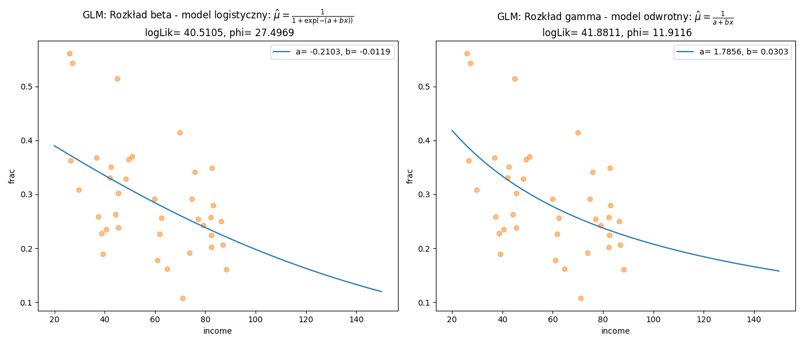

# Rozkład beta {#R4}

---

## Funkcja gęstości {#R41}

Rozkład beta na przedziale $[a,b]$ został zaimplementowany do funkcji [`scipy.stats.beta`](https://docs.scipy.org/doc/scipy-1.2.1/reference/generated/scipy.stats.beta.html#scipy.stats.beta) gdzie: `loc`$=a$ oraz `scale`$=b-a$. Funkcję gęstości prawdopodobieństwa tego rozkładu można zapisać za pomocą wzoru:
\begin{equation}
f(x\;|\;a,b,\alpha,\beta)=\frac{1}{\mathrm{B}(\alpha,\beta)(b-a)^{\alpha+\beta-1}}(x-a)^{\alpha-1}(b-x)^{\beta-1}
(\#eq:bet01)
\end{equation}
po podstawieniu:
$$\mathrm{B}(\alpha,\beta)(b-a)^{\alpha+\beta-1}=\int_{a}^{b}u^{\alpha-1}(1-u)^{\beta-1}du=\frac{\Gamma(\alpha)\Gamma(\beta)}{\Gamma(\alpha+\beta)}(b-a)^{\alpha+\beta-1}$$
otrzymamy:
\begin{equation}
f(x\;|\;a,b,\alpha,\beta)=\frac{\Gamma(\alpha+\beta)}{\Gamma(\alpha)\Gamma(\beta)(b-a)^{\alpha+\beta-1}}(x-a)^{\alpha-1}(b-x)^{\beta-1}
(\#eq:bet02)
\end{equation}
gdzie: $E(x)=a+\frac{\alpha}{\alpha+\beta}(b-a)$ oraz $V(x)=\frac{\alpha\beta}{(\alpha+\beta)^2(\alpha+\beta+1)}(b-a)^2$.
  
Standardowa wersja rozkładu beta jest rozpatrywana na przedziale $[0;1]$ a więc wzór \@ref(eq:bet02) upraszcza się do postaci:
\begin{equation}
f(x\;|\;\alpha,\beta)=\frac{\Gamma(\alpha+\beta)}{\Gamma(\alpha)\Gamma(\beta)}x^{\alpha-1}(1-x)^{\beta-1}
(\#eq:bet03)
\end{equation}
gdzie: $E(x)=\frac{\alpha}{\alpha+\beta}$ oraz $V(x)=\frac{\alpha\beta}{(\alpha+\beta)^2(\alpha+\beta+1)}$.

Jeśli do wzoru \@ref(eq:bet03) podstawimy $\alpha=\mu\phi$ oraz $\beta=(1-\mu)\phi$ dla $\alpha+\beta=\phi$ to otrzymamy:
\begin{equation}
f(x\;|\;\mu,\phi)=\frac{\Gamma(\phi)}{\Gamma(\mu\phi)\Gamma\big((1-\mu)\phi\big)}x^{\mu\phi-1}(1-x)^{(1-\mu)\phi-1}
(\#eq:bet04)
\end{equation}
gdzie: $E(X)=\mu$ oraz $V(X)=\frac{\mu(1-\mu)}{1+\phi}$.

Po zlogarytmowaniu funkcji prawdopodobieństwa \@ref(eq:bet04) 
otrzymamy funkcję logarytmu wiarygodności o postaci:
\begin{equation}
LL_{beta}=\ln\Gamma(\phi)-\ln\Gamma(\mu\phi)-\ln\Gamma\big((1-\mu)\phi\big)+(\mu\phi-1)\ln(x)+\big((1-\mu)\phi-1\big)\ln(1-x)
(\#eq:betLL01)
\end{equation}

```{r engine='python',engine.path='python3',python.reticulate=FALSE}
import scipy.stats as stats
  
y = stats.beta.rvs(1.78, 2.34, size=100, random_state=2305)

f = stats.beta.fit(y)
logLik = sum(stats.beta.logpdf(y, a=f[0], b=f[1], loc=f[2], scale=f[3]))

print("alpha= %.4f, beta= %.4f, loc= %.4f, scale= %.4f" \
      % (f[0],f[1],f[2],f[3]))
print("\nlogLik= %.4f" % (logLik))
```

## Liniowy model beta regresji {#R42}

Rozkład beta zdefiniowany za pomocą wzoru \@ref(eq:bet04) jest wykorzystywany do budowy liniowego modelu regresji dla proporcji. Inaczej mówiąc, w regresji beta wartości zmiennej zależnej mogą określać np. pewną frakcję dochodów gospodarstw domowych wydawanych na żywność.
Po podstawieniu do wzoru \@ref(eq:betLL01)
$\hat{\mu}=\frac{1}{1+\exp(-\hat{y})}$ gdzie $\hat{y}=\beta_0+\sum_{j=1}^{n}\beta_j x_{ij}$ otrzymamy parametry modelu beta regresji. Dodatkowo parametr precyzji $\phi$ może być uważany za stały lub
można go rozszerzyć o dodatkowy zestaw regresorów tzn. $\phi=\exp(\hat{y})$.
Zastosowanie liniowego modelu beta regresji zostanie zaprezentowane na przykładzie zestawu danych [`FoodExpenditure`](https://rdrr.io/rforge/betareg/man/FoodExpenditure.html).

```{r engine='python',engine.path='python3',python.reticulate=FALSE}
import numpy as np
import scipy.stats as stats
import matplotlib.pyplot as plt
import pandas as pd
import statsmodels.api as sm
import patsy
from scipy.optimize import minimize

df = pd.read_csv("https://raw.githubusercontent.com/krzysiektr/datacsv/master/FoodExpenditure.csv")
df["frac"] = df["food"]/df["income"]

y, x = patsy.dmatrices('frac ~ income', df, return_type='dataframe')
ols = sm.OLS(y,x).fit()
b = ols.params.values

def L_beta(par):
    mod = par[0]+ par[1]*df["income"]
    mu = stats.logistic.cdf(mod)
    phi = par[2]
    shape1 = mu*phi
    shape2 = (1-mu)*phi
    logLik = -np.sum( stats.beta.logpdf(df["frac"], a=shape1, b=shape2) )
    return(logLik)

def L_gamma(par):
    mod = par[0]+ par[1]*df["income"]
    mu = 1/mod
    shape = par[2]
    scale = mu/shape
    logLik = -np.sum( stats.gamma.logpdf(df["frac"], a=shape, scale=scale) )
    return(logLik)

initParams = [b[0],b[1],1]
res = [minimize(i, initParams, method= "Nelder-Mead") for i in [L_beta,L_gamma]]

fig = plt.figure(figsize=(14,6))
ax1 = fig.add_subplot(1,2,1)
ax2 = fig.add_subplot(1,2,2)
Xg = np.linspace(20,150, 1000)
ax1.plot(df["income"],df["frac"],'o',alpha=0.5,color='C1')
ax1.plot(Xg,1/(1+np.exp(-1*(res[0].x[0]+res[0].x[1]*Xg))),color='C0',
         label='a= %.4f, b= %.4f' % (res[0].x[0],res[0].x[1]))
ax1.set_xlabel("income")
ax1.set_ylabel("frac")
ax1.set_title("GLM: Rozkład beta - model logistyczny: $\\hat{\\mu}=\\frac{1}{1+\\exp(-(a+bx))}$\n logLik= %.4f, phi= %.4f" % (-1*res[0].fun,res[0].x[2]))
ax1.legend()
ax2.plot(df["income"],df["frac"],'o',alpha=0.5,color='C1')
ax2.plot(Xg,1/(res[1].x[0]+res[1].x[1]*Xg),color='C0',
         label='a= %.4f, b= %.4f' % (res[1].x[0],res[1].x[1]))
ax2.set_xlabel("income")
ax2.set_ylabel("frac")
ax2.set_title("GLM: Rozkład gamma - model odwrotny: $\\hat{\\mu}=\\frac{1}{a+bx}$\n logLik= %.4f, phi= %.4f" % (-1*res[1].fun,res[1].x[2]))
ax2.legend()
fig.tight_layout()
plt.savefig('prop01.png')
```
```{r prop01, echo=FALSE, fig.pos= 'h', fig.show='hold', fig.align='center', fig.cap="Graficzna prezentacja nieliniowej zależności frakcji wydatków na żywność i dochodów.", out.width = '100%'}

```
