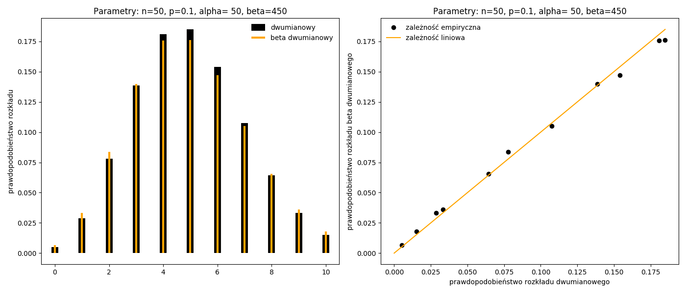
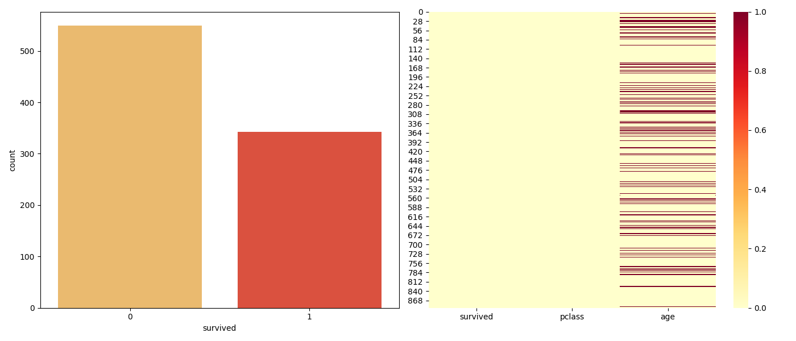
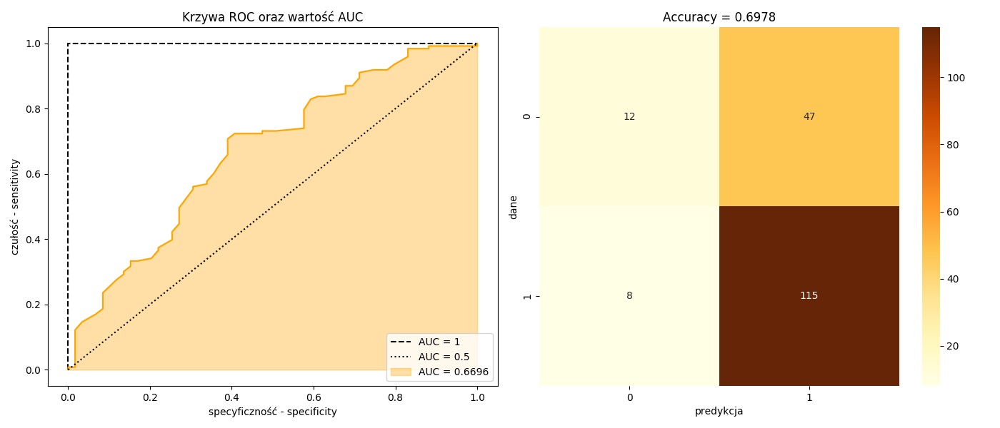

# Rozkład beta dwumianowy {#R5}

---

## Funkcja gęstości {#R51}

Złożenie dwóch rozkładów: dwumianowego oraz beta na przedziale $(0,1)$ tworzy rozkład beta dwumianowy o postaci:
\begin{equation}
f(x\;|\;n,\alpha,\beta)=\displaystyle\underbrace{{n\choose x}\;p^x (1-p)^{n-x}}_{\mbox{rozkład dwumianowy}} \cdot \displaystyle\underbrace{\frac{1}{\mathrm{B}(\alpha,\beta)}p^{\alpha-1}(1-p)^{\beta-1}}_{\mbox{rozkład beta}}
(\#eq:bb01)
\end{equation}
w którym po podstawieniu:
$${n \choose x}=\frac{\Gamma(n+1)}{\Gamma(x+1)\Gamma(n-x+1)}\quad \mbox{oraz}\quad p^{x+\alpha-1}(1-p)^{n-x+\beta-1}=\mathrm{B}(x+\alpha,\;n-x+\beta)$$
otrzymamy:
\begin{equation}
f(x\;|\;n,\alpha,\beta)=\frac{\Gamma(n+1)}{\Gamma(x+1)\Gamma(n-x+1)}\cdot\frac{1}{\mathrm{B}(\alpha,\beta)}\cdot \mathrm{B}(x+\alpha, \;n-x+\beta)
(\#eq:bb02)
\end{equation}
gdzie: 
$E(X)=n\frac{\alpha}{\alpha+\beta}$ oraz $V(X)=n\frac{\alpha\beta(\alpha+\beta+n)}{(\alpha+\beta)^2(\alpha+\beta+1)}$.

Za pomocą rozkładu beta dwumianowego $f(x\;|\;n,\alpha,\beta)$ można przybliżać rozkład dwumianowy
gdzie: $\alpha=n$ oraz $\beta=n(1-p)/p$.
```{r engine='python',engine.path='python3',python.reticulate=FALSE}
import numpy as np
import scipy.stats as stats
import scipy.special as spec
import matplotlib.pyplot as plt

def bb(x,n,alpha,beta):
    B1 = (spec.gamma(n+1)*spec.beta(x+alpha,n-x+beta))
    B2 = (spec.gamma(x+1)*spec.gamma(n-x+1)*spec.beta(alpha,beta))
    return(B1/B2)

x = [0,1,2,3,4,5,6,7,8,9,10]
n = 50
p = 0.1
BB = [bb(i,n,n,n*(1-p)/p).round(7) for i in x]
B  = [stats.binom.pmf(i,n,p).round(7) for i in x]
fig = plt.figure(figsize=(14,6))
ax1 = fig.add_subplot(1,2,1)
ax2 = fig.add_subplot(1,2,2)
ax1.vlines(x, 0, B, colors='k', linestyles='-', lw=10,\
           label='dwumianowy')   
ax1.vlines(x, 0, BB, colors='orange', linestyles='-', lw=3,\
           label='beta dwumianowy')
ax1.set_title('Parametry: n=%.0f, p=%.1f, alpha= %.0f, beta=%.0f' % (n,p,n,n*(1-p)/p))
ax1.set_ylabel('prawdopodobieństwo rozkładu')
ax1.legend(loc='best', frameon=False) 
ax2.plot(B,BB,'o',color='k',label='zależność empiryczna')
ax2.plot([0,max(B)],[0,max(B)],color='orange',label='zależność liniowa')
ax2.set_title('Parametry: n=%.0f, p=%.1f, alpha= %.0f, beta=%.0f' % (n,p,n,n*(1-p)/p))
ax2.set_xlabel('prawdopodobieństwo rozkładu dwumianowego')
ax2.set_ylabel('prawdopodobieństwo rozkładu beta dwumianowego')
ax2.legend(loc='best', frameon=False)
plt.tight_layout()
plt.savefig("betabinom.png")
```
```{r betabinom, echo=FALSE, fig.pos= 'h', fig.show='hold', fig.align='center', fig.cap="Przybliżanie rozkładu dwumianowego rozkładem beta dwumianowym.", out.width = '100%'}

```

Po uwzględnieniu parametryzacji:
$\alpha=\mu\rho^{-1}(1-\rho)$ i $\beta=(1-\mu)\rho^{-1}(1-\rho)$ lub $\alpha=\mu/\sigma$ i  $\beta=(1-\mu)/\sigma$
otrzymamy zmodyfikowany rozkład beta dwumianowy w którym funkcję logarytmu wiarygodności można zapisać za pomocą wzoru:
\begin{equation}
LL=\ln\Gamma(n+1)+\ln \mathrm{B}\left(x+\frac{\mu}{\sigma},n-x+\frac{1-\mu}{\sigma}\right)-\ln\Gamma(x+1)-\ln\Gamma(n-x+1)-\ln \mathrm{B}\left(\frac{\mu}{\sigma},\frac{1-\mu}{\sigma}\right)
(\#eq:bb03)
\end{equation}

## Liniowy model beta dwumianowej regresji {#R52}

Zastosowanie liniowego modelu beta dwumianowej regresji zostanie zaprezentowane na przykładzie zestawu danych [`titanic`](https://github.com/mwaskom/seaborn-data/blob/master/titanic.csv). Na ich podstawie
możemy obliczyć prawdopodobieństwo ocalenia życia w katastrofie brytyjskiego transatlantyka Titanic w
zależności od wieku pasażera oraz klasy podróżowania.
```{r engine='python',engine.path='python3',python.reticulate=FALSE}
import warnings
warnings.filterwarnings("ignore")

import seaborn as sns
import numpy as np
import pandas as pd
import matplotlib.pyplot as plt
  
df = sns.load_dataset("titanic")

fig = plt.figure(figsize=(14,6))
ax1 = fig.add_subplot(1,2,1)
ax2 = fig.add_subplot(1,2,2)
sns.countplot(x = 'survived', data = df, palette = 'YlOrRd',ax=ax1)
sns.heatmap(df[['survived','pclass','age']].isnull(),cmap='YlOrRd',ax=ax2)
plt.tight_layout()
plt.savefig("titanic.png")
```
```{r titanic, echo=FALSE, fig.pos= 'h', fig.show='hold', fig.align='center', fig.cap="Graficzna prezentacja danych Titanic.", out.width = '100%'}

```
Rozkład beta dwumianowy jest wykorzystywany do budowy liniowego modelu regresji dla danych binarnych jako alternatywa np. dla regresji logitowej/probitowej. W tym zastosowaniu optymalizujemy (maksymalizacja) funkcję daną wzorem \@ref(eq:bb03) w której $\hat{\mu}=\frac{1}{1+\exp(-\hat{y})}$ dla $\hat{y}=\beta_0+\sum_{j=1}^{n}\beta_j x_{ij}$ otrzymamy parametry modelu beta dwumianowej regresji.

```{r engine='python',engine.path='python3',python.reticulate=FALSE}
import seaborn as sns
import numpy as np
import scipy.stats as stats
import pandas as pd
import scipy.special as spec
from scipy.optimize import minimize
import patsy

df = sns.load_dataset("titanic").dropna()
survived = df['survived']
pclass = df['pclass']
age = df['age']
yObs, xObs = patsy.dmatrices('survived ~ pclass + age', df, return_type='dataframe')
b0, b1, b2 = np.linalg.lstsq(xObs, yObs, rcond=None)[0]

def Lbb(x,mu,sigma,n):
    return spec.loggamma(n+1)+spec.betaln(x+mu/sigma,n-x+((1-mu)/sigma))-\
           spec.loggamma(x+1)-spec.loggamma(n-x+1)-spec.betaln(mu/sigma,(1-mu)/sigma)

def h(par):
    mod = par[0] +par[1]*pclass +par[2]*age
    MU  = stats.logistic.cdf(mod)
    SIGMA = par[3]
    logLik = -np.sum( Lbb(survived, mu=MU, sigma=SIGMA, n=1) )
    return(logLik)

initParams = [b0[0],b1[0],b2[0],1]
bnds = ((None, None), (None,None),(None, None), (0,None))
results = minimize(h, initParams, method= "L-BFGS-B", bounds=bnds)
print("GLM: family= beta-binomial, link= logistic\n")
print("const= %.4f, pclass= %.4f, age= %.4f, phi= %.4f" % (results.x[0],results.x[1],results.x[2],results.x[3]))
print("\nlogLik= %.4f" % (-1*results.fun))
```
Wyniki można porównać ze standardowym rozwiązaniem tzn. liniowym modelem regresji logitowej lub probitowej. W optymalizacji funkcji logarytmu wiarygodności rozkładu dwumianowego wykorzystujemy dystrybuantę rozkładu logistycznego (logit) lub normalnego (probit). Instnieje pewna zależność pomiędzy parametrami z tych dwóch modeli tzn. $\beta_{probit} \approx 1.6\cdot\beta_{logit}$. Dodatkowo można wyznaczyć efekty krańcowe za pomocą funkcji [`get_margeff`](https://www.statsmodels.org/dev/generated/statsmodels.discrete.discrete_model.CountResults.get_margeff.html). Krzywa ROC informuje nas o jakości modelu tzn. im wykres bardziej "wypukły", tym lepszy model. Zatm pole pod krzywą (AUC - Area Under ROC Curve) powinno być większe od $0.5$.
```{r engine='python',engine.path='python3',python.reticulate=FALSE,warning=FALSE, message=FALSE}
import pandas as pd
import statsmodels.api as sm
import patsy
import seaborn as sns
from sklearn.metrics import roc_curve, auc, confusion_matrix
import numpy as np
import matplotlib.pyplot as plt

df = sns.load_dataset("titanic").dropna()
y, x = patsy.dmatrices('survived ~ pclass + age', df, return_type='dataframe')
      
logit = sm.Logit(y,x).fit()
print(logit.params)

yp = logit.predict()
fpr, tpr, thresholds = roc_curve(y, yp)
aur = auc(fpr,tpr)
sens = tpr[thresholds > 0.5][-1]     # czułość
spec = 1 - fpr[thresholds > 0.5][-1] # specyficzność
xx = np.arange(101) / float(100)
ypp = (yp>0.5).astype(int)
tab = confusion_matrix(y,ypp)
tn, fp, fn, tp = confusion_matrix(y,ypp).ravel()

fig = plt.figure(figsize=(14,6))
ax1 = fig.add_subplot(1,2,1)
ax2 = fig.add_subplot(1,2,2)
ax1.plot([0,0,1],[0,1,1], '--', color='k', label='AUC = 1')
ax1.plot(fpr,tpr, color='orange')
ax1.plot(xx,xx, ':', color='k', label='AUC = 0.5')
ax1.fill_between(x=fpr, y1=tpr, color='orange', alpha=0.35, label='AUC = %.4f' % aur)
ax1.set_title("Krzywa ROC oraz wartość AUC")
ax1.set_xlabel('specyficzność - specificity')
ax1.set_ylabel('czułość - sensitivity')
ax1.legend()
sns.heatmap(tab,annot=True, fmt="d",cmap="YlOrBr",ax=ax2)
ax2.set_title("Accuracy = %.4f" % ((tp+tn)/(tp+tn+fp+fn)))
ax2.set_xlabel('predykcja')
ax2.set_ylabel('dane')
plt.tight_layout()
plt.savefig("roc.png")
```
```{r roc, echo=FALSE, fig.pos= 'h', fig.show='hold', fig.align='center', fig.cap="Krzywa ROC i tablica trafności prognoz.", out.width = '100%'}

```
