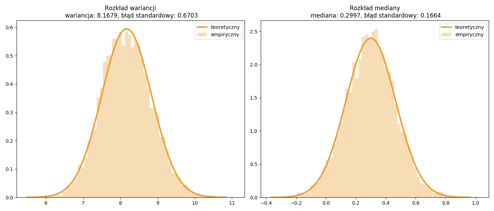

# Błąd standardowy estymatora {#R7}

## Średnia {#R71}

Średnia jest parametrem który ma swoje zastosowanie dla rozkładów symetrycznych. 
Błąd standardowy estymatora średniej $\bar{x}$ można zapisać za pomocą wzoru:
\begin{equation}
SE_{\bar{x}}=\sqrt{s^2/n}
(\#eq:se01)
\end{equation}
gdzie: $s^2$ to nieobciążony estymator wariancji: $\sum_{i=1}^{n}(x_i-\bar{x})^2/(n-1)$ oraz $\bar{x}$ to estymator średniej czyli $\sum_{i=1}^{n}x_i/n$. Dodatkowo $x_i$ to kolejne elementy próby a $n$ to liczebność próby.
```{r engine='python',engine.path='python3',python.reticulate=FALSE}
import numpy as np
import scipy.stats as stats

y = stats.norm.rvs(size=300,scale=3,random_state=4101)

MU = np.mean(y)
SE_mu = np.sqrt(np.var(y, ddof=1)/len(y))
conf = [ stats.norm.ppf(i, loc=MU, scale=SE_mu) for i in [0.025,0.975] ]
p = stats.norm.cdf(0, MU, SE_mu)

print("średnia:",MU,", błąd:",SE_mu)
print("95% przedział ufności:",conf)
print("\nH0: mu = 0 vs. H1: mu != 0")
print("p-wartość:",2*min(p,1-p))
```
Ponieważ badamy hipotezę zerową $H_0:\mu=0$ więc takie same wyniki można uzyskać za pomocą funkcji regresji liniowej. 
```{r engine='python',engine.path='python3',python.reticulate=FALSE}
from scipy import stats
import pandas as pd

df = pd.DataFrame(data={'y':stats.norm.rvs(size=300,scale=3,random_state=4101)})

import statsmodels.formula.api as smf

m = smf.glm('y ~ 1', data=df).fit().summary().tables[1]
print(m)
```

## Proporcja {#R72}

Obliczenie proporcji na podstawie próby binarnej czyli zawierającej tylko zera (porażka) i jedynki (sukces) sprowadza się do wyznaczenia średniej. Przykładem może być zmienna `plec` gdzie: `0` - kobieta, `1` - mężczyzna. 
Błąd standardowy dla oszacowanej frakcji $\hat{p}$ jest dany wzorem:
\begin{equation}
SE_{\hat{p}}=\sqrt{\big(\hat{p}(1-\hat{p})\big)/n}\quad\mbox{gdzie}\quad \hat{p}\in(0,1)
(\#eq:se02)
\end{equation}
```{r engine='python',engine.path='python3',python.reticulate=FALSE}
from scipy import stats
import numpy as np

y = stats.binom.rvs(n=1, p=0.3, loc=0, size=50, random_state=2305)

P = np.mean(y)
SE_pw = np.sqrt((P*(1-P))/len(y))
conf = [ stats.norm.ppf(i, loc=P, scale=SE_pw) for i in [0.025,0.975] ]
p = stats.norm.cdf(0.5, P, SE_pw)

print("proporcja:",P,", błąd:",SE_pw)
print("95% przedział ufności:",conf)
print("\nH0: p = 0.5 vs. H1: p != 0.5")
print("p-wartość:",2*min(p,1-p))
```

Więcej procedur budowy przedziału ufności dla proporcji jest zaimplementowanych do funkcji
[`statsmodels.stats.proportion.proportion_confint`](https://www.statsmodels.org/stable/generated/statsmodels.stats.proportion.proportion_confint.html#statsmodels.stats.proportion.proportion_confint) w której metoda Walda \@ref(eq:se02) jest rozwiązaniem domyślnym.
```{r engine='python',engine.path='python3',python.reticulate=FALSE}
from statsmodels.stats.proportion import proportion_confint
from scipy import stats

y = stats.binom.rvs(n=1, p=0.3, loc=0, size=50, random_state=2305)

print(proportion_confint(sum(y), 50, alpha=0.05, method='normal'))
```

## Mediana {#R73}

Jednym z bardziej popularnych odpornych estymatorów średniej jest mediana czyli drugi kwartyl który dzieli uporządkowany rosnąco zbiór obserwacji $x$ na połowę. Wartość środkowa to $x_{(n+1)/2}$ lub $(x_{n/2}+x_{(n/2 )+1})/2$ odpowiednio dla nieparzystej i parzystej liczebności danych.
Do estymacji przedziałowej mediany często jest wykorzystywany błąd standardowy:
\begin{equation}
SE_{np_0}=\sqrt{p_0(1-p_0)\cdot n}\quad\mbox{gdzie}\quad p_0=0.5
(\#eq:se03)
\end{equation}
Po uporządkowaniu rosnąco danych wybieramy dwa elementy o indeksach $v_1$ i $v_2$ które wyznaczają dolną $x_{v_1}$ i górną $x_{v_2}$ granicę przedziału ufności gdzie:
\begin{equation}
v_1=\lceil \Phi^{-1}(\alpha/2,\;np_0,SE_{np_0})\rceil,\quad v_2=\lceil  \Phi^{-1}(1-\alpha/2,\;np_0,SE_{np_0})\rceil
(\#eq:se04)
\end{equation}
Dodajmy, że dla mediany czyli $p_0=0.5$ otrzymamy $np_0=n/2$ oraz $SE_{np_0}=\sqrt{n/4}$.

W innym rozwiązaniu [@ms1984] wykorzystywany jest błąd standardowy mediany dany wzorem:
\begin{equation}
SE_{\hat{m}}=\frac{x_{n-k+1}-x_{k}}{2\cdot z_{\,0.995}}\quad \mathrm{dla}\quad k=\frac{n+1}{2}-z_{\,0.995}\cdot\sqrt{\frac{n}{4}}
(\#eq:se05)
\end{equation}
gdzie kwantyle z rozkładu normalnego: $\Phi^{-1}(\alpha/2,\;\hat{m},SE_{\hat{m}})$ oraz $\Phi^{-1}(1-\alpha/2,\;\hat{m},SE_{\hat{m}})$
to odpowiednio dolna i górna granica przedziału ufności.

Zwróćmy uwagę, że powyższe metody nie uwzględniają wartości wiązanych a więc są przeznaczone dla danych ciągłych. W artykule [@iwasaki2005] jest przedstawiona metoda która uwzględnia występowanie duplikatów:
\begin{equation}
v=\left[n/2-z_{1-\alpha/2}\cdot \sqrt{n/4}\right]+1,\quad v^{\prime}=\left[n/2-z_{1-\alpha/2}\cdot\sqrt{n/4}+0,5\right]+1
(\#eq:se06)
\end{equation}
\begin{equation}
\begin{aligned}
x_{v}\,,\;x_{n+1-v}
&
&
\textrm{dla}\quad
&
v=v^{\prime}\\[0.0in]
(x_{v-1}+x_{v})/2\,,\;(x_{n+1-v}+x_{(n+1-v)+1})/2
&
&
\textrm{dla}\quad
&
v=v^{\prime}-1
\end{aligned}
(\#eq:se07)
\end{equation}

W literaturze [@wilcox2017] można znaleźć jeszcze wiele innych propozycji. Za przykład może posłużyć estymator Harrella–Davisa [@hd1982] dla mediany lub wybranych kwantyli:
\begin{equation}
HD_{q}=\sum_{i=1}^{n}\left[\Big(B(i/n,\,a,\,b)-B((i-1)/n,\,a,\,b)\Bigr)x_{i}\right]
(\#eq:se08)
\end{equation}
z wykorzystaniem rozkładu beta (patrz rozdział \@ref(R4)):
\begin{equation}
B(t,a,b)=\int_{0}^{t}\frac{\Gamma(a+b)}{\Gamma(a)\Gamma(b)}x^{a-1}(1-x)^{b-1}\;dx
(\#eq:se09)
\end{equation}
gdzie: $a=(n+1)q$ oraz $b=(n+1)(q-1)$ dla $q=0.5$ w przypadku drugiego kwartyla czyli mediany.
Błąd standardowy estymatora mediany Harrella–Davisa można obliczyć za pomocą funkcji [`scipy.stats.mstats.hdquantiles_sd`](https://docs.scipy.org/doc/scipy/reference/generated/scipy.stats.mstats.hdquantiles_sd.html#scipy.stats.mstats.hdquantiles_sd) do której zaimplementowano metodę jackknife. Inne rozwiązanie to wykorzystanie metody bootstrap (patrz podrozdział \@ref(R78)) w której można wykorzystać estymator Harrella–Davisa zaimplementowany w funkcji [`scipy.stats.mstats.hdquantiles`](https://docs.scipy.org/doc/scipy/reference/generated/scipy.stats.mstats.hdquantiles.html).

```{r engine='python',engine.path='python3',python.reticulate=FALSE}
from scipy import stats

y = stats.norm.rvs(size=300,scale=3,random_state=4101)

MD = stats.mstats.hdquantiles(y,[0.5])[0]
SE_md = stats.mstats.hdquantiles_sd(y,[0.5])[0]
conf = [ stats.norm.ppf(i, loc=MD, scale=SE_md) for i in [0.025,0.975] ]
p = stats.norm.cdf(0, MD, SE_md)

print("medianaHD:",MD,", błąd:",SE_md)
print("95% przedział ufności:",conf)
print("\nH0: md = 0 vs. H1: md != 0")
print("p-wartość:",2*min(p,1-p))
```

## Wariancja {#R74}

Błąd standardowy estymatora wariancji [@asym2009] można obliczyć za pomocą wzoru:
\begin{equation}
SE_{s^2}=\sqrt{S^2/n}
(\#eq:se11)
\end{equation}
gdzie $S^2$ to nieobciążony estymator wariancji dla zmiennej $z_i=(x_i-\bar{x})^2$.


```{r engine='python',engine.path='python3',python.reticulate=FALSE}
from scipy import stats
import numpy as np

y = stats.norm.rvs(size=300,scale=3,random_state=4101)

V = np.var(y,ddof=1)
z = (y-np.mean(y))**2
SE_v = np.sqrt(np.var(z,ddof=1)/len(z))
conf = [ stats.norm.ppf(i, loc=V, scale=SE_v) for i in [0.025,0.975] ]
p = stats.norm.cdf(10, V, SE_v)

print("wariancja:",V,", błąd:",SE_v)
print("95% przedział ufności:",conf)
print("\nH0: var = 10 vs. H1: var != 10")
print("p-wartość:",2*min(p,1-p))
```

Inne rozwiązanie [@FK2016] jest przedstawione poniżej:

\begin{equation}
SE_{var}=\sqrt{\left(\frac{1}{2(n-2)} +\frac{1}{2n}-\frac{2}{n - 3}\right) v^2 + 
        \left(\frac{3}{n-3}-\frac{2}{n-2}\right) m_4}
(\#eq:se12)
\end{equation}
gdzie: $m_4=\sum_{i=1}^{n}(x_i-\bar{x})^4/n$ to czwarty moment centralny oraz $v=\sum_{i-1}^{n}(x_i-\bar{x})^2/(n-1)$ to nieobciążony estymator wariancji.
```{r engine='python',engine.path='python3',python.reticulate=FALSE}
from scipy import stats
import numpy as np

y = stats.norm.rvs(size=300,scale=3,random_state=4101)

n = len(y)
v2 = np.var(y,ddof=1)**2
m4 = stats.moment(y, moment=4)
SE_v = np.sqrt((1/(2*n-4)+1/(2*n)-2/(n-3))*v2+(3/(n-3)-2/(n-2))*m4)
print("wariancja:",v2**0.5,", błąd:",SE_v)
```

## Średnia ucięta {#R75}

W przypadku gdy dane nie pochodzą z rozkładu normalnego (np. gdy rozkład jest skośny, w danych występują obserwacje odstające itp.) wnioskowanie o populacji z wykorzystaniem średniej nie jest dobrym wyborem. Jednym z możliwych rozwiązań jest zweryfikowanie hipotezy statystycznej dotyczącej średniej uciętej [@tmc1963] w oparciu o rozkład t-Studenta ze stopniami swobody $df=n-2\lfloor n G \rfloor -1$. Estymator średniej uciętej jest obliczany na podstawie próbki z której została usunięta pewna frakcja skrajnych obserwacji a jego błąd standardowy jest dany wzorem:
\begin{equation}
SE_{\bar{x}_t}=s_w/(1-2G)\sqrt{n}
(\#eq:se10)
\end{equation}
gdzie: $sw$ to odchylenie standardowe obliczone na podstawie próbki poddanej procesowi winsoryzacji.
```{r engine='python',engine.path='python3',python.reticulate=FALSE}
from scipy import stats
import numpy as np

y = stats.norm.rvs(size=300,scale=3,random_state=4101)

tMU = stats.mstats.trimmed_mean(y,limits=(0.2,0.2))
SE_tmu = stats.mstats.trimmed_stde(y,limits=(0.2,0.2))
conf = stats.mstats.trimmed_mean_ci(y, limits=(0.2, 0.2))
df = len(y) - 2 * np.floor(0.2 * len(y)) - 1
p = stats.t.cdf(0, df, tMU, SE_tmu)

print("średnia ucięta:",tMU,", błąd:",SE_tmu)
print("95% przedział ufności:",conf)
print("\nH0: tmu = 0 vs. H1: tmu != 0")
print("p-wartość:",2*min(p,1-p))
```
Warto dodać, że dla parametru ucięcia $G$ równego 0 wynik będzie tożsamy z testem t-Studenta który został zaimplementowany do funkcji [`scipy.stats.ttest_1samp`](https://docs.scipy.org/doc/scipy/reference/generated/scipy.stats.ttest_1samp.html).

## Skośność {#R76}

W rozkładzie normalnym (rozkład symetryczny) parametr skośności jest równy zero. Wartość tego parametru może być większa lub mniejsza od zera dla rozkładu odpowiednio prawostronnie skośnego lub lewostronnie skośnego. Dla podstawowej wersji parametru skośności $g1=m_3/m_2^{3/2}$ bład standardowy można zapisać za pomocą wzoru:
\begin{equation}
SE_{g1}=\sqrt{\frac{6(n-2)}{(n+1)(n+3)}}
(\#eq:sk01)
\end{equation}
gdzie: $m_2$ i $m_3$ to odpowiednio drugi i trzeci moment centralny, $n$ to liczebność próby.

```{r engine='python',engine.path='python3',python.reticulate=FALSE}
from scipy import stats

y = stats.norm.rvs(size=300,scale=3,random_state=4101)

g1 = stats.skew(y)
n = len(y)
SE_g1 = ((6*(n-2))/((n+1)*(n+3)))**0.5
conf = [ stats.norm.ppf(i, loc=g1, scale=SE_g1) for i in [0.025,0.975] ]
p = stats.norm.cdf(0, g1, SE_g1)

print("skośność:",g1,", błąd:",SE_g1)
print("95% przedział ufności:",conf)
print("\nH0: skew = 0 vs. H1: skew != 0")
print("p-wartość:",2*min(p,1-p))
```
Warto dodać, że zostały opracowane również inne estymatory skośności [@kurt2011] które są modyfikacjami parametru $g1$. Ciekawe rozwiązanie na bazie
transformacji skośności [@agos1970] zostało zaimplementowane do funkcji [`scipy.stats.skewtest`](https://docs.scipy.org/doc/scipy/reference/generated/scipy.stats.skewtest.html) i bada hipotezę zerową $H_0:\;S= 0$.
```{r engine='python',engine.path='python3',python.reticulate=FALSE}
from scipy import stats

y = stats.norm.rvs(size=300,scale=3,random_state=4101)

print(stats.skewtest(y))
```

## Kurtoza {#R77}

Podstawowa wersja parametru kurtozy jest dana wzorem $g2=m_4/m_2^2-3$ i dla rozkładu normalnego przyjmuje wartość zero. Jeśli kurtoza jest większa od zera to rozkład jest spiczasty tzw. rozkład leptokurtyczny. Natomiast gdy kurtoza jest mniejsza od zera to rozkład jest spłaszczony tzw. platykurtyczny. Te określenia są formułowane w stosunku do rozkładu normalnego tzw. rozkładu mezokurtycznego. Błąd standardowy dla estymatora $g2$ można przedstawić za pomocą wzoru:

\begin{equation}
SE_{g2}=\sqrt{\frac{24n(n-2)(n-3)}{(n+1)^2(n+3)(n+5)}}
(\#eq:ku01)
\end{equation}
gdzie: $m_2$ i $m_4$ to odpowiednio drugi i czwarty moment centralny, $n$ to liczebność próby.
```{r engine='python',engine.path='python3',python.reticulate=FALSE}
from scipy import stats

y = stats.norm.rvs(size=300,scale=3,random_state=4101)

g2 = stats.kurtosis(y)
n = len(y)
SE_g2 = ((24*n*(n-2)*(n-3))/((n+1)**2*(n+3)*(n+5)))**0.5
conf = [ stats.norm.ppf(i, loc=g2, scale=SE_g2) for i in [0.025,0.975] ]
p = stats.norm.cdf(0, g2, SE_g2)

print("kurtoza:",g2,", błąd:",SE_g2)
print("95% przedział ufności:",conf)
print("\nH0: kurt = 0 vs. H1: kurt != 0")
print("p-wartość:",2*min(p,1-p))
```

Podobnie jak w przypadku parametru skośności (patrz podrozdział \@ref(R76)) zostały wprowadzone pewne modyfikacje parametru $g2$ [@kurt2011]. Istotność statystyczną  parametru $g2+3$ można badać za pomocą transformacji [@ansom1983]. To rozwiązanie jest dostępne dzięki funkcji
[`scipy.stats.kurtosistest`](https://docs.scipy.org/doc/scipy/reference/generated/scipy.stats.kurtosistest.html) i bada hipotezę zerową $H_0:\;K= 3$.

```{r engine='python',engine.path='python3',python.reticulate=FALSE}
from scipy import stats

y = stats.norm.rvs(size=300,scale=3,random_state=4101)

print(stats.kurtosistest(y))
```

## Bootstrap {#R78}

Metoda bootstrap jest często stosowane gdy nie wiemy z jakiego rozkładu pochodzi zmienna losowa. Polega ona na wielokrotnym losowaniu ze zwracaniem z próby w celu wyznaczenia $B$ estymatorów $\hat{\theta}$ . Inaczej mówiąc, tworzymy wektor $\hat{\theta}^*_{i}=[\hat{\theta}_1,\;\hat{\theta}_2,\;\dots,\;\hat{\theta}_B]$
i na jego podstawie obliczamy średnią (szacunek estymatora) oraz odchylenie standardowe (błąd estymatora). Jednym z możliwych rozwiązań jest zastosowanie pętli [`for`](https://wiki.python.org/moin/ForLoop) w połączeniu z funkcją [`numpy.random.choice`](https://het.as.utexas.edu/HET/Software/Numpy/reference/generated/numpy.random.choice.html) a następnie obliczenie wartości estymatora i jego błąd standardowy odpowiednio z wykorzystaniem funkcji [`numpy.mean`](https://docs.scipy.org/doc/numpy/reference/generated/numpy.mean.html) oraz [`numpy.std`](https://docs.scipy.org/doc/numpy/reference/generated/numpy.std.html).
Poniżej przykład dla parametru skośności (patrz podrozdział \@ref(R76)) dla metody bootstrap.
```{r engine='python',engine.path='python3',python.reticulate=FALSE}
import numpy as np
import scipy.stats as stats

y = stats.norm.rvs(size=300,scale=3,random_state=4101)

B = 10000
S = [stats.skew(np.random.choice(y,size=len(y))) for i in range(B)]
conf = np.percentile(S, [2.5, 97.5])
p = np.mean(np.less(S,[0]))

print("skośność:",np.mean(S),", błąd:",np.std(S,ddof=1))
print("95% przedział ufności:",conf)
print("\nH0: skew = 0 vs. H1: skew != 0")
print("p-wartość:",2*min(p,1-p))
```
Do wyznaczenia wektora $\hat{\theta}^*_i$ można wykorzystać funkcję [`astropy.stats.bootstrap`](http://docs.astropy.org/en/stable/api/astropy.stats.bootstrap.html#astropy.stats.bootstrap) która jest przeznaczona do generowania próbek bootstrap.
Poniżej przykład dla wariancji (patrz podrozdział \@ref(R74)) oraz mediany (patrz podrozdzial \@ref(R73)).
```{r engine='python',engine.path='python3',python.reticulate=FALSE,warning=FALSE,message=FALSE }
import numpy as np
import scipy.stats as stats
from astropy.stats import bootstrap
import matplotlib.pyplot as plt

y = stats.norm.rvs(size=300,scale=3,random_state=4101)
B = 10000
stat = lambda x: (np.var(x,ddof=1), stats.mstats.hdquantiles(x,[0.5])[0])
boot = bootstrap(np.array(y), bootnum=B, bootfunc=stat)
V  = boot[:,0] # próbka bootstrap dla wariancji
MD = boot[:,1] # próbka bootstrap dla mediany

fig = plt.figure(figsize=(14,6))
ax1 = fig.add_subplot(1,2,1)
ax2 = fig.add_subplot(1,2,2)

ax1.hist(V, density=True,alpha=0.35,bins=60,color="#ea9f2f",label="empiryczny")
xV = np.linspace(np.mean(V)-4*np.std(V,ddof=1),np.mean(V)+4*np.std(V,ddof=1),100)
ax1.plot(xV,stats.norm.pdf(xV,loc=np.mean(V),scale=np.std(V,ddof=1)),
         lw=3,color="#ea9f2f",label="teoretyczny")
ax2.hist(MD, density=True,alpha=0.35,bins=60,color="#ea9f2f",label="empiryczny")
xMD = np.linspace(np.mean(MD)-4*np.std(MD,ddof=1),np.mean(MD)+4*np.std(MD,ddof=1),100)
ax2.plot(xMD,stats.norm.pdf(xMD,loc=np.mean(MD),scale=np.std(MD,ddof=1)),\
         lw=3,color="#ea9f2f",label="teoretyczny")
ax1.set_title("Rozkład wariancji\n wariancja: %.4f, błąd standardowy: %.4f" \
% (np.mean(V),np.std(V,ddof=1)))
ax2.set_title("Rozkład mediany\n mediana: %.4f, błąd standardowy: %.4f" \
% (np.mean(MD),np.std(MD,ddof=1)))
ax1.legend(); ax2.legend()
fig.tight_layout()
plt.savefig('boot01.png')
```
```{r boot01, echo=FALSE, fig.pos= 'h', fig.show='hold', fig.align='center', fig.cap="Rozkład empiryczny (bootstrap) vs rozkład teoretyczny (normalny).", out.width = '100%'}

```

W metodach symulacyjnych można również wykorzystać generatory liczb losowych jeśli wiemy z jakiego rozkładu pochodzi próba. Przykładowo dla proporcji będzie to rozkład dwumianowy o parametrach np. $p=0,3$ oraz $n=50$ (patrz podrozdział \@ref(R72)).
```{r engine='python',engine.path='python3',python.reticulate=FALSE}
import numpy as np
import scipy.stats as stats

mc = [np.mean(stats.binom.rvs(n=1, p=0.3, loc=0, size=50)) for i in range(10000)]
P_mc = np.mean(mc)
SE_p_mc = np.std(mc,ddof=1)
conf = np.percentile(mc, [2.5, 97.5])
p = np.mean(np.less(mc,[0.5]))

print("proporcja:",P_mc,", błąd:",SE_p_mc,"\n95% przedział ufności:",conf)
print("\nH0: p = 0.5 vs. H1: p != 0.5","\np-wartość:",2*min(p,1-p))
```
